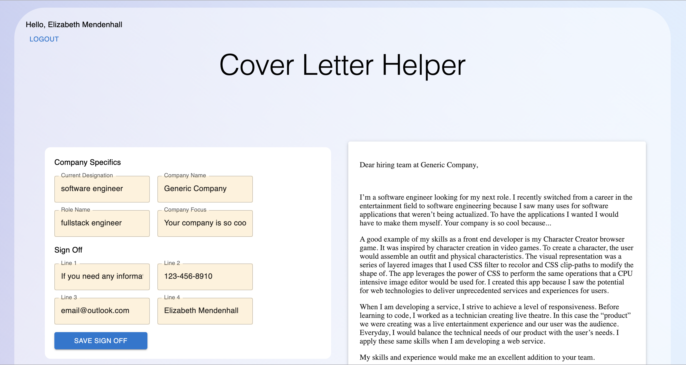
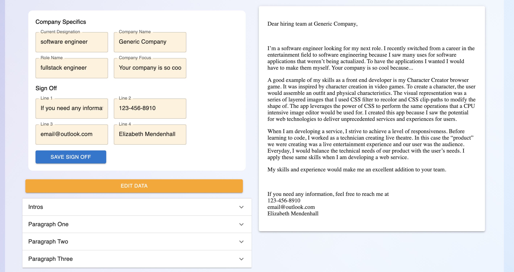
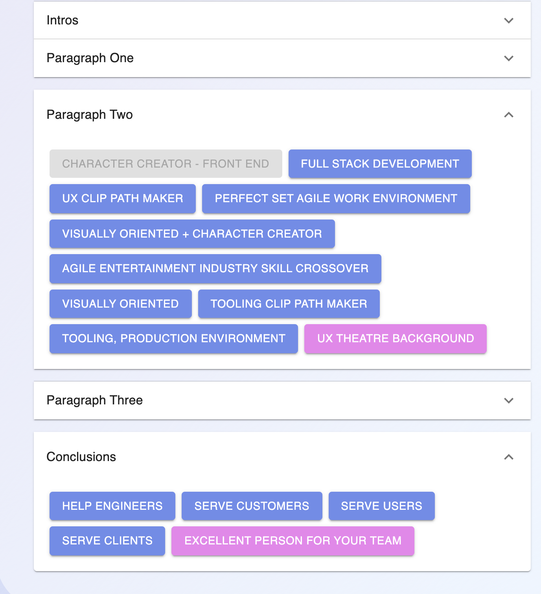
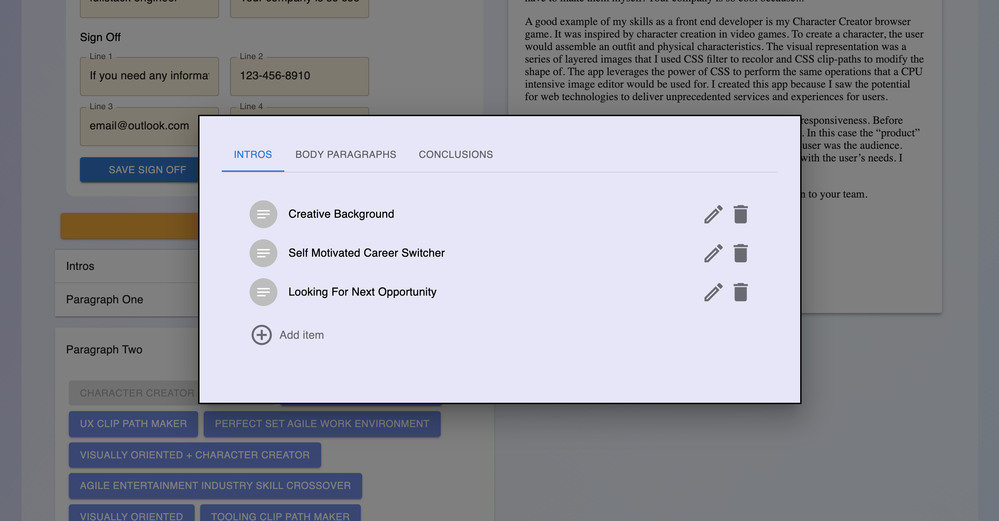
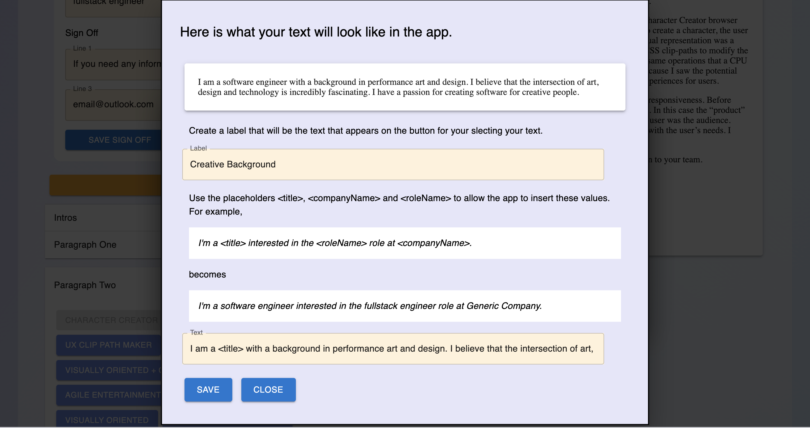

# Cover Letter Helper

This is a React-Firebase app for creating cover letter templates. It uses Google's Firebase Authentication to handle login and Firestore to save sections of a cover letter so job seekers can avoid redundant work and better organize descriptions of their achievements.

   

## Why I chose to create this app
 For early career software developers, getting that first position is the hardest. Most people need to send out countless applications. Creating a cover letter can improve the quality of an application but they are time consuming to make.

I found myself spending hours creating that perfect, polished and tailored cover letter and I frequently realized that I was writing about the same topics I already covered in previous cover letters.

Don't reinvent the wheel!

This app allows the user to save sections of cover letters they've already written and arrange them into new documents. Cover Letter Helper gives the user much more customization than simply using a generic Google Doc template.

The new cover letter is previewed on the side and dynamically updated to reflect user changes.

   

The user can easily use topics they've already written about.

   

They can add, edit or delete entries.

   

The app can substitute user input for details like their current designation or the name of the company they are applying for.

   

The user can then use the resulting document for applications or further customize it on their own.

Deployment coming soon!
